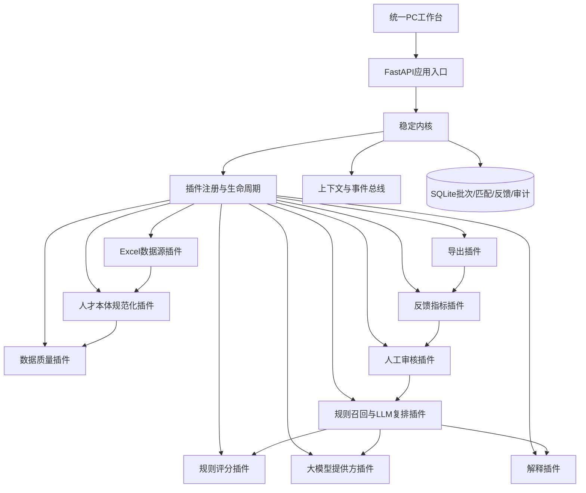
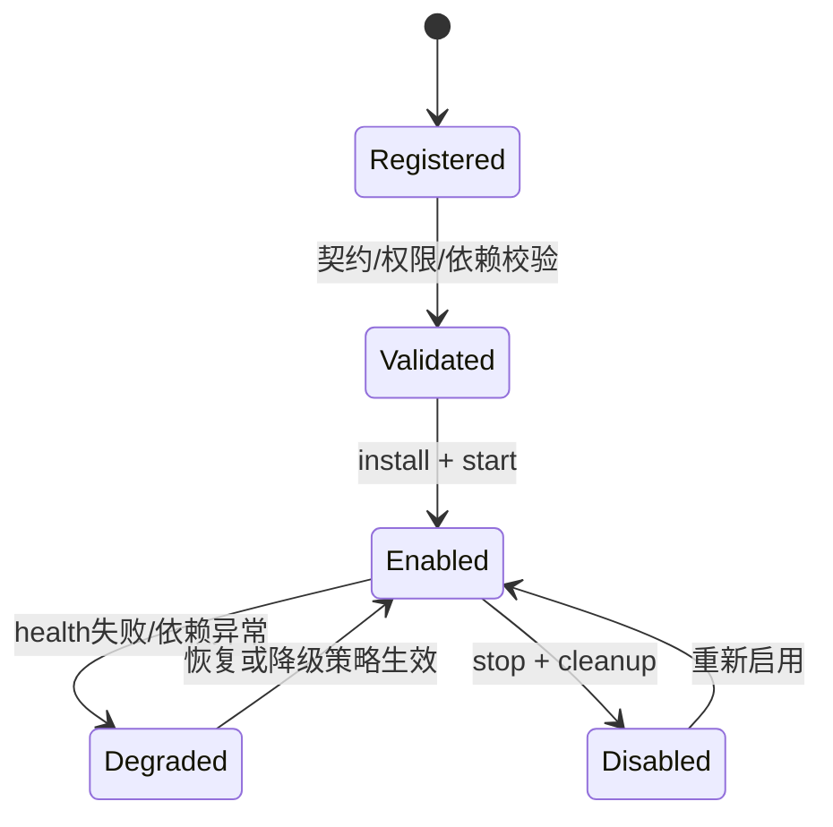

# 架构说明

## 1. 总体结构

## 2. 稳定内核只做什么

- 身份与角色：业务操作员、审核人。
- 插件注册、Manifest校验、依赖拓扑、受控启停与健康状态。
- 服务能力注册、事件发布、配置和审计。
- 批次、人员快照、岗位快照、匹配、审核、反馈等系统内状态。
- 文件大小、数据边界、CSV公式注入等基础安全控制。

内核不包含岗位规则、Excel字段、匹配算法、审核状态或报表逻辑；这些均由插件提供。

本体不是数据库替代品。本版本以版本化 JSON-LD 保存概念和同义词，以 SQLite 保存人员/岗位快照、标准概念 ID、映射证据和业务过程状态。未来若需要多跳关系推理，可只替换本体存储/查询插件。

大模型同样不是内核特权能力。`llm-provider` 以 `provider + model` 显式路由 OpenAI Chat Completions 兼容接口，`semantic-ranker` 只依赖 `llm.rerank` 能力键。替换模型供应商不需要改写规则、数据库或审核流程；密钥不进入插件状态、前端与业务数据库。

## 3. 生命周期

本版本不动态下载未知代码，也不承诺任意热模块替换。插件来自静态、受审查的目录；停用时会检查下游依赖，防止破坏核心闭环。

## 4. 未来插件插槽

后续可按同一契约增加：5+2/BOSS/51job适配器、企微/微信触达、OCR简历、政策RAG、经营看板、源系统写回和多县复制。每个插件需单独完成权限、数据域、依赖、故障隔离、补偿策略及验收评审。
