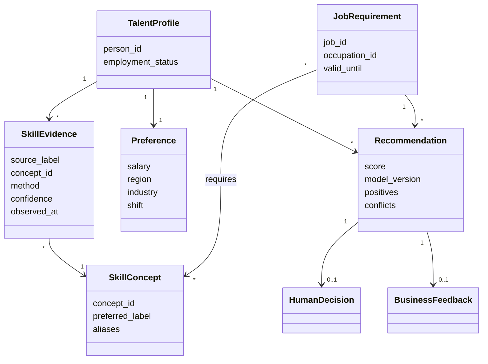

# 最小人才本体设计

## 为什么MVP需要本体，但不需要完整知识图谱

Excel字段已经结构化。首期最主要的语义风险不是“LLM读不懂表格”，而是同一技能或岗位存在多种写法、岗位要求与人员标签层级不一致、自动识别缺少证据。本体层先统一概念ID、同义词和岗位—技能关系，再让匹配算法或未来LLM使用这些规范概念。

## 核心概念

## LLM接入原则

当前MVP不调用外部LLM。未来LLM识别插件必须：

1. 只接收当前任务需要的本体切片，不把完整人员库发送给模型；
2. 按 `data/ontology/person_profile.schema.json` 输出；
3. 每个概念保留源文本、证据、置信度和模型版本；
4. 未映射或低置信度结果进入人工复核，不自动覆盖源数据；
5. 姓名、证件号、手机号与语义画像隔离，不作为匹配特征。

## 升级路径

- MVP：JSON-LD词表 + SQLite运营数据 + 确定性别名映射。
- Next：LLM抽取插件 + 本体检索切片 + 人工标注回流。
- Later：当出现跨地区、多跳技能关系、图推理或SPARQL需求时，再接入RDF/图数据库插件。

